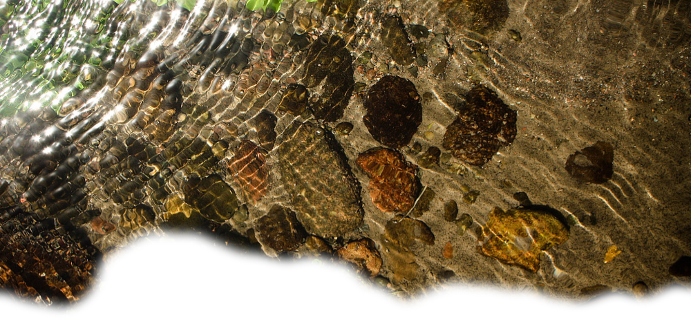
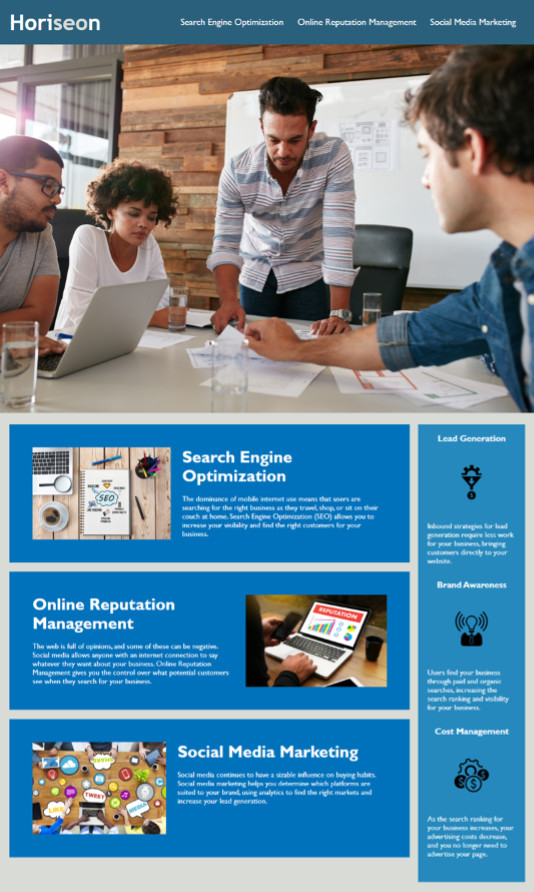
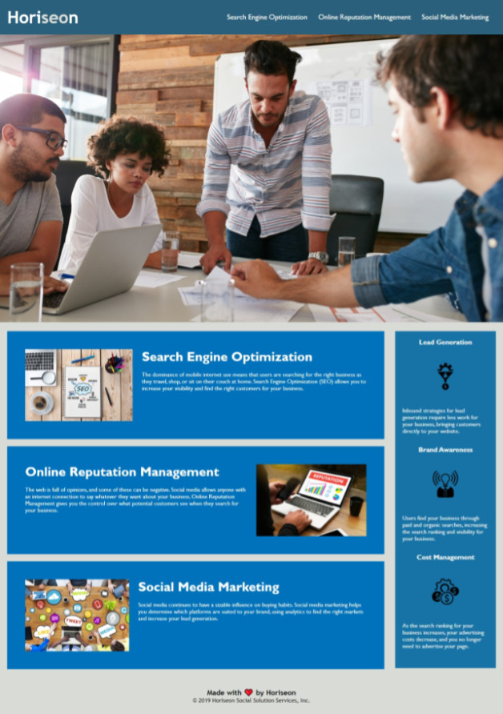

# USYD-FSF Week1 Project
## Refactoring - improve website accessibility rating

### Table of Contents  
  
   1. [Project Description](#1-description)
   2. [Application Features](#2-features)
   3. [Installation](#3-installation)
   4. [Usage](#4-usage)
   5. [Credits](#5-credits)
   6. [License](#6-license)
   7. [Repository Status](#7-github-repo-status)
   8. [Contribute](#8-how-to-contribute)
   9. [Tests](#9-tests)
   10. [Checklist](#10-checklist)

---
### 1. Description  
**What is this project?**  
* An on the job ticket.  

**Why this project?**  
* The client, Horiseon, requested improving the accessibility rating of their website.  Accessible sites rank higher in search engines.  Horiseon are a SEO marketing agency and high accessibility ratings are critical to their credibility and reputation because accessible sites rank higher in search engines.

**What problem does this project solve?**  
* Improve the sites Search Engine Optimisation (SEO) by improving it's accessibility rating.
* The code has been tidied up and annotated to communicate every change.
* Some performance improvements have been implemented like adjusting image sizes so the page renders quicker and testing all hyperlinks are functioning and fixing if required.

**Lessons learnt?**  
* In future I will consider using [webAIM](https://usyd.watsonised.com) to assess colour contrast quicker for accessibility compliance / improvements.
* Compliance with the Web Content Accessibility Guidelines (WCAG) has not been tested.  [The WCAG contrast standard. ](https://www.w3.org/WAI/WCAG21/quickref/?showtechniques=141%2C143#contrast-minimum) however using the browser's developer tool, a thorough scan of the elements has been carried out.

---
### 2. Features  
Client requested features as implemented:  
- Single webpage that collects a visitor’s contact information.
- Landing page has a header and footer.
- Landing page has an image with a caption.
- Landing page has a contact form.
- Landing page is polished and has an accessible UI.

#### The before ▼ and after ►:
 
---
### 3. Installation  
After downloading, open the index.html file to review the website inside your selected web browser.  
The webpage has also been hosted via [URL: usyd.watsonised.com](https://usyd.watsonised.com)

---
### 4. Usage  
The code can be downloaded from the [Github repository](https://github.com/Mark33Mark/code-refactor-usyd-unit1) for all assets created for the project.  A live version is currently being hosted by Github at the following [URL: usyd.watsonised.com](https://usyd.watsonised.com)

---
### 5. Credits  
No credits for this work, all work has been completed without reference.

---
### 6. License  
 The works in this repository are subject to:  

---
### 7. Github repo status  

---
### 8. How to Contribute
 If you would like to contribute, please comply with the Contributor Covenant Code of Conduct:  

---
### 9. Tests  
No tests will be provided for this project as it is limited to HTML and CSS files. 

---
### 10. Checklist  
 All actions not checked are still to be completed:
  * [x]  Links function correctly.
  * [x]  CSS selectors and properties are consolidated and organied to follow semantic structure.
  * [x]  CSS file has been properly commented.
  * [x]  Deployed at live URL, [website](https://usyd.watsonised.com) 
  * [x]  Webpage loads with no errors.
  * [x]  Application resembles mock-up provided in the brief (at least 90%)
  * [x]  Github repository contains application code [Github location](https://github.com/Mark33Mark/code-refactor-usyd-unit1)
  * [x]  Repository has a unique name; follows best practice for file structure; and naming conventions.
  * [x]  Repsository follows best practices for class/id naming conventions, indentation, quality comments, etc.
  * [x]  Repository contains multiple descriptive commit messages.
  * [x]  Repository contains a README file with descriptio, screenshot and link to deployed application.
---

- [Back to the top](#usyd-fsf-week1-project)